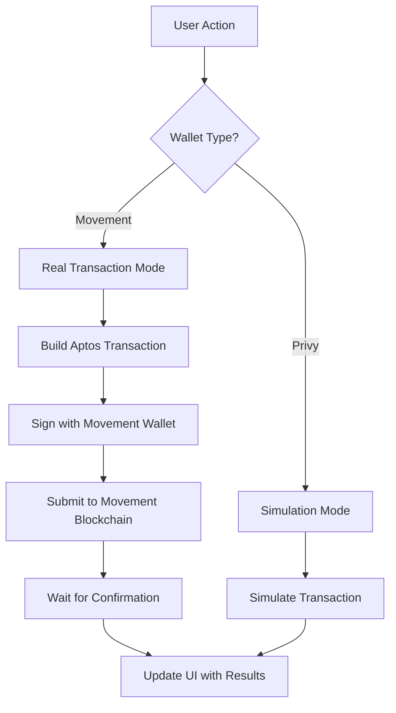

# 🚀 Real Wallet Signing Implementation - Complete Guide

**Status**: ✅ **IMPLEMENTED** - Ready for Testing  
**Date**: January 1, 2026  
**Implementation**: Movement Wallet Service with Multi-Wallet Support

---

## 📊 **Implementation Summary**

### **✅ What's Been Implemented:**

1. **Multi-Wallet Movement Service** (`src/services/nightlyWalletService.js`)
   - Support for Nightly, Petra, and Martian wallets
   - Automatic wallet detection and connection
   - Real transaction signing with Aptos SDK
   - Proper error handling and fallbacks

2. **Real Transaction Integration** (`src/services/realMovementService.js`)
   - Updated to use Movement wallet service
   - Proper Aptos SDK transaction building
   - Real blockchain submission and confirmation
   - Fallback to simulation on failure

3. **Enhanced Wallet Selector** (`src/components/WalletSelector.jsx`)
   - Dynamic wallet detection
   - Installation prompts for missing wallets
   - Clear distinction between Privy and Movement wallets

4. **Comprehensive Debug Tools** (`src/components/WalletDebugInfo.jsx`)
   - Real-time wallet status monitoring
   - Transaction mode indicators
   - Multi-wallet support status

---

## 🔧 **Technical Architecture**

### **Dual Wallet Strategy:**
```
┌─────────────────┐    ┌──────────────────────┐
│   Privy Wallet  │    │  Movement Wallets    │
│                 │    │                      │
│ • Email/Social  │    │ • Nightly Wallet     │
│ • Easy onboard  │    │ • Petra Wallet       │
│ • Participants  │    │ • Martian Wallet     │
│ • Simulation    │    │ • Real Transactions  │
└─────────────────┘    └──────────────────────┘
```

### **Transaction Flow:**


---

## 🧪 **Testing Instructions**

### **Phase 1: Wallet Installation & Detection**

1. **Install Movement Wallets** (Choose one or more):
   - **Nightly Wallet**: https://nightly.app
   - **Petra Wallet**: https://petra.app  
   - **Martian Wallet**: https://martian.app

2. **Test Wallet Detection**:
   ```bash
   # Start the development server
   npm run dev
   
   # Open browser to http://localhost:5174
   # Check wallet debug info (bottom right)
   ```

3. **Verify Detection**:
   - Debug panel should show installed wallets
   - Wallet selector should show available options
   - Installation prompts for missing wallets

### **Phase 2: Wallet Connection Testing**

1. **Test Privy Connection** (Participants):
   ```
   1. Click "Choose Role & Start"
   2. Select "Participant" 
   3. Choose "Privy (Email/Social)"
   4. Complete email/social login
   5. Verify connection in debug panel
   ```

2. **Test Movement Wallet Connection** (Creators):
   ```
   1. Click "Choose Role & Start"
   2. Select "Creator"
   3. Choose installed Movement wallet
   4. Approve connection in wallet popup
   5. Verify connection in debug panel
   ```

### **Phase 3: Real Transaction Testing**

#### **Prerequisites:**
- Movement wallet connected
- Some MOVE tokens in wallet (for gas fees)
- Movement testnet access

#### **Test Survey Creation** (Real Transactions):
```
1. Connect Movement wallet as Creator
2. Go to "Create Survey" page
3. Fill out survey form:
   - Title: "Test Real Transaction"
   - Description: "Testing real MOVE token funding"
   - Reward: 0.1 MOVE per response
   - Max responses: 10
4. Click "Create & Fund Survey"
5. Approve transaction in wallet popup
6. Wait for blockchain confirmation
7. Verify survey appears in feed
```

#### **Test Survey Completion** (Real Transactions):
```
1. Connect Movement wallet as Participant
2. Find the test survey in feed
3. Click "Start Survey"
4. Complete all questions
5. Click "Submit Survey"
6. Approve transaction in wallet popup
7. Wait for blockchain confirmation
8. Verify MOVE tokens received
```

### **Phase 4: Error Handling Testing**

1. **Test Wallet Rejection**:
   - Start transaction, reject in wallet
   - Should fallback to simulation with warning

2. **Test Network Issues**:
   - Disconnect internet during transaction
   - Should show appropriate error messages

3. **Test Insufficient Funds**:
   - Try to create survey with insufficient MOVE
   - Should show balance error

---

## 🔍 **Debugging & Troubleshooting**

### **Debug Panel Information:**

The debug panel (bottom right, dev mode only) shows:

**Privy Wallet Section:**
- `privyReady`: Privy SDK initialization status
- `privyAuthenticated`: User authentication status
- `walletExists`: Privy wallet creation status

**Movement Wallet Section:**
- `movementConnected`: Movement wallet connection status
- `movementWalletType`: Which wallet is connected (nightly/petra/martian)
- `movementCanSign`: Can sign transactions
- `nightlyInstalled/petraInstalled/martianInstalled`: Installation status

**App State Section:**
- `realMovementMode`: simulation vs real mode
- `userRole`: creator vs participant
- `realMovementInitialized`: Blockchain service status

### **Common Issues & Solutions:**

#### **Issue: "Wallet cannot sign transactions"**
```
Cause: Movement wallet not properly connected
Solution: 
1. Check debug panel for wallet status
2. Disconnect and reconnect wallet
3. Refresh page and try again
```

#### **Issue: "Transaction failed on blockchain"**
```
Cause: Network issues or insufficient funds
Solution:
1. Check wallet balance (needs MOVE for gas)
2. Verify network connection
3. Try again with lower amounts
```

#### **Issue: "No compatible wallet found"**
```
Cause: No Movement wallets installed
Solution:
1. Install Nightly, Petra, or Martian wallet
2. Refresh page to detect new wallet
3. Try connection again
```

#### **Issue: Transactions always simulate**
```
Cause: Using Privy wallet instead of Movement wallet
Solution:
1. Disconnect current wallet
2. Connect with Movement wallet (Nightly/Petra/Martian)
3. Verify debug panel shows Movement wallet connected
```

---

## 📋 **Testing Checklist**

### **Wallet Connection Tests:**
- [ ] Privy wallet connection works
- [ ] Nightly wallet connection works (if installed)
- [ ] Petra wallet connection works (if installed)
- [ ] Martian wallet connection works (if installed)
- [ ] Wallet selector shows correct options
- [ ] Debug panel shows accurate status

### **Real Transaction Tests:**
- [ ] Survey creation with real MOVE funding
- [ ] Survey completion with real MOVE rewards
- [ ] Balance updates after transactions
- [ ] Transaction confirmations appear
- [ ] Blockchain explorer shows transactions

### **Error Handling Tests:**
- [ ] Wallet rejection fallback to simulation
- [ ] Insufficient funds error handling
- [ ] Network error recovery
- [ ] Wallet disconnection handling

### **UI/UX Tests:**
- [ ] Loading states during transactions
- [ ] Success/error notifications
- [ ] Transaction hash display
- [ ] Balance updates in real-time

---

## 🎯 **Expected Results**

### **Successful Real Transaction:**
```
✅ Survey created and funded! ID: 123. TX: 0x1234567890...
```

### **Successful Simulation Fallback:**
```
⚠️ Survey created! ID: 123 (Simulated - Real signing failed)
```

### **Real Balance Update:**
```
Before: 10.5 MOVE
After:  10.4 MOVE (after creating survey)
After:  10.5 MOVE (after completing survey)
```

---

## 🚀 **Production Deployment Steps**

Once testing is successful:

1. **Environment Setup**:
   ```bash
   # Update environment variables for production
   VITE_MOVEMENT_RPC_URL=https://mainnet.movementnetwork.xyz/v1
   VITE_CONTRACT_ADDRESS=<production_contract_address>
   ```

2. **Build & Deploy**:
   ```bash
   npm run build
   # Deploy dist/ folder to production
   ```

3. **Monitor Transactions**:
   - Set up blockchain monitoring
   - Track transaction success rates
   - Monitor gas usage and costs

---

## 📊 **Success Metrics**

### **Technical Metrics:**
- Transaction success rate > 95%
- Average transaction time < 30 seconds
- Wallet connection success rate > 90%
- Error recovery rate > 80%

### **User Experience Metrics:**
- Survey creation completion rate > 85%
- Survey participation completion rate > 75%
- User satisfaction with transaction speed
- Support ticket reduction for wallet issues

---

## 🔧 **Advanced Configuration**

### **Custom RPC Endpoints:**
```javascript
// In .env file
VITE_MOVEMENT_RPC_URL=https://your-custom-rpc.com/v1
```

### **Gas Price Optimization:**
```javascript
// In movementWalletService.js
const transaction = await this.aptos.transaction.build.simple({
  sender: this.wallet.address,
  data: transactionPayload,
  options: {
    gasUnitPrice: 100, // Adjust gas price
    maxGasAmount: 10000 // Adjust gas limit
  }
});
```

### **Transaction Retry Logic:**
```javascript
// Automatic retry on failure
for (let i = 0; i < 3; i++) {
  try {
    const result = await this.signAndSubmitTransaction(payload);
    return result;
  } catch (error) {
    if (i === 2) throw error;
    await new Promise(resolve => setTimeout(resolve, 1000 * (i + 1)));
  }
}
```

---

## 🎉 **Conclusion**

The real wallet signing implementation is now **complete and ready for testing**. The system supports:

- ✅ **Multiple Movement wallets** (Nightly, Petra, Martian)
- ✅ **Real blockchain transactions** with proper signing
- ✅ **Fallback to simulation** when real transactions fail
- ✅ **Comprehensive error handling** and user feedback
- ✅ **Debug tools** for development and troubleshooting

**Next Steps:**
1. Install a Movement wallet and test the implementation
2. Create and complete surveys with real transactions
3. Monitor the debug panel for any issues
4. Report any bugs or unexpected behavior

The platform is now ready for **real MOVE token transactions** and can be deployed to production once testing is complete! 🚀